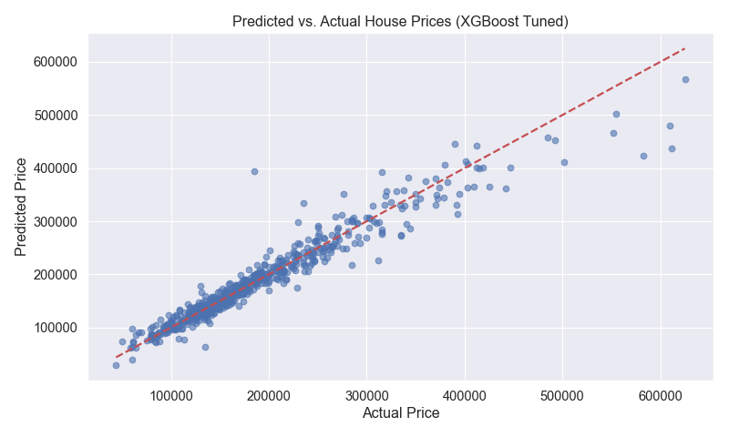
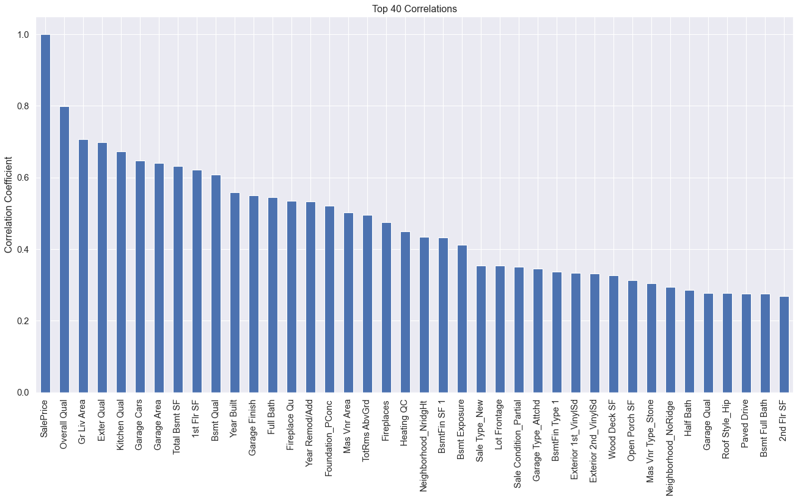

# 🏠 House Price Prediction

Predict residential house sale prices using machine learning models trained on the Ames Housing Dataset. This project encompasses data preprocessing, exploratory data analysis (EDA), model development, hyperparameter tuning, and deployment as an interactive Streamlit web application for real-time price estimation.

<p align="center"> <a href="https://your-deployment-url-here" target="_blank">  </a> </p>

---

## 🌐 Live App

👉 [House Price Prediction Streamlit App](https://your-deployment-url-here)  

---

### 🧠 App Highlights

- Intuitive UI for inputting key house features  
- User-friendly mappings for categorical and ordinal variables  
- Real-time price prediction powered by a tuned XGBoost regression model  
- Handles mixed numeric and categorical data seamlessly  
- Backed by thorough exploratory data analysis and feature engineering  

---

## 🔍 Problem Statement

Accurately estimating house sale prices is critical for buyers, sellers, and real estate professionals. This project develops a predictive model to estimate prices based on diverse property characteristics, addressing data challenges like missing values, skewness, and categorical encoding, to deliver reliable market value predictions.

---

## 🧰 Tools & Technologies

- **Python** (development and scripting)  
- **Data Processing**: `pandas`, `numpy`  
- **Exploratory Data Analysis**: `matplotlib`, `seaborn`  
- **Machine Learning**: `xgboost`, `scikit-learn` (Random Forest baseline), `joblib` for serialization  
- **Web App Framework**: Streamlit  
- **Version Control**: Git & GitHub  

---

## 📁 Dataset

- **Source**: [Ames Housing Dataset](https://www.kaggle.com/datasets/prevek18/ames-housing-dataset/data) by Dean De Cock on Kaggle  
- **Size**: 82 explanatory variables describing physical, location, and quality attributes  
- **Data Challenges**: Missing values handled by imputing zeros or relevant replacements; irrelevant features (Order, PID) removed; ordinal categorical variables encoded numerically; OneHotEncoder applied in modeling pipeline  

---

## 🔄 Workflow Summary

- Data Cleaning & Preprocessing  
- Exploratory Data Analysis (EDA) for feature insights and distributions  
- Feature Engineering and Encoding (Ordinal + OneHot)  
- Model Training & Hyperparameter Tuning (Random Forest & XGBoost)  
- Model Evaluation using R², MAE, RMSE metrics  
- Deployment with Streamlit for interactive predictions  

---

## 📊 Model Performance

| Model           | Train R² | Test R² | MAE      | RMSE     |
|-----------------|----------|---------|----------|----------|
| Random Forest   | 0.988    | 0.909   | 15,480   | 27,056   |
| XGBoost (Tuned) | 0.990    | 0.928   | 14,291   | 24,076   |

*XGBoost demonstrated superior predictive accuracy and generalization, making it the deployed model.*

---

## 📊 Exploratory Data Analysis (EDA)

Key observations include:  

- Strong correlations between overall quality, living area, and sale price  
- Impact of neighborhood and basement quality on pricing  
- Identification and treatment of outliers and skewed features  

### 📈 Sample Visualizations

#### Predicted vs Actual Price


#### Correlation Chart


---

## 📁 Project Structure
```
├── data/
│ └── AmesHousing.csv 
| └── train_data.csv 
├── images/
│ └── [plots and visualizations]
├── models/
│ └── XGBMODEL_pipeline.joblib 
├── app.py 
├── README.md
├── requirements.txt
└── House_Price_Prediction.ipynb```

---

## ✅ How to Run Locally

1. Clone this repository
2. Install dependencies:
   ```bash
   pip install -r requirements.txt
   ```
3. Open the notebook:
   ```bash
   jupyter notebook House_Price_Prediction.ipynb
   ```
4. Or launch the app:
   ```bash
   streamlit run app.py
   ```

---

## 📬 Contact

**Mahmood Arafat**  
Aspiring AI Engineer | Machine Learning Enthusiast

I'm passionate about building intelligent systems that solve real-world problems. With a background in Mechanical Engineering and hands-on experience in Python, data analysis, and model development, I'm actively transitioning into AI and machine learning—one project at a time.
[LinkedIn](https://www.linkedin.com/in/arafat-mahmood-3b0208213/) | [Email](Mahmoodarafat08@gmail.com)

---
